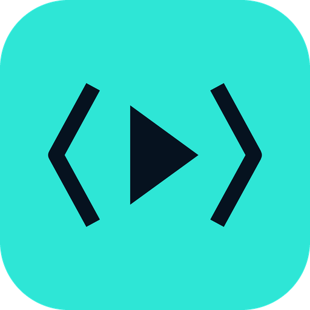
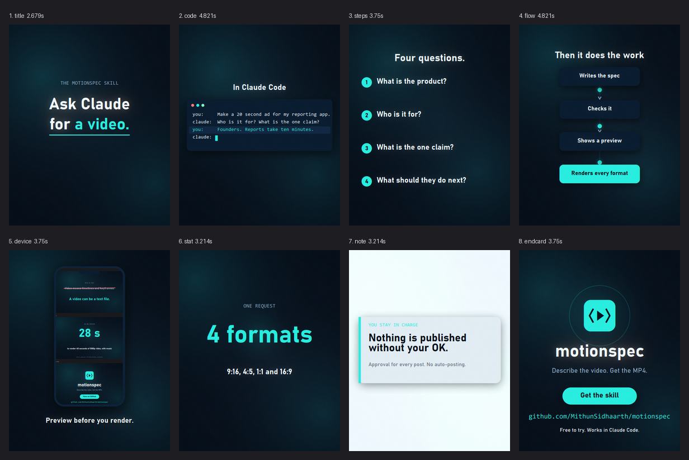
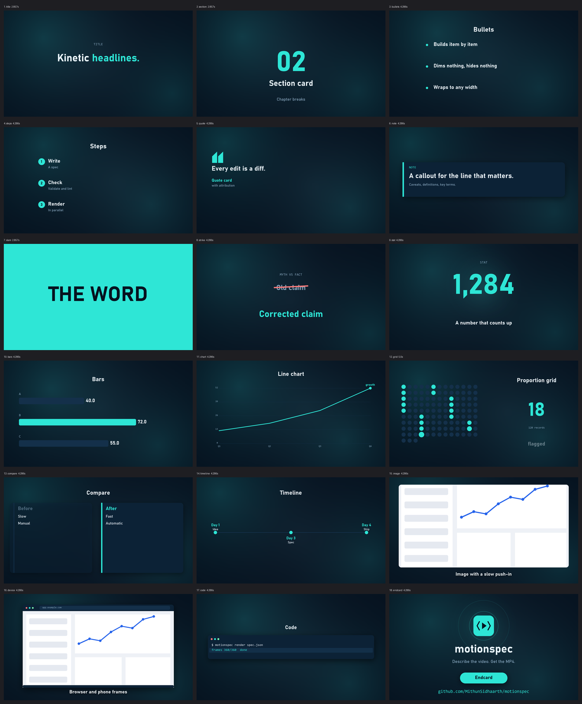
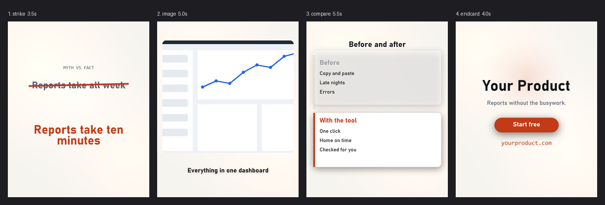

<p align="center">
  
</p>

<h1 align="center">motionspec</h1>
<p align="center"><b>Weekly product videos from a text file.</b><br>
For solo founders and small teams who need explainers and ads in every screen shape, on brand, without opening an editor.</p>

<p align="center">
  
</p>
<p align="center"><sub>This ad was made by motionspec, from <a href="examples/ad_motionspec.json">one JSON file</a>. <a href="docs/media/motionspec_ad_landscape.mp4">Full-quality MP4</a>. Other shapes: <code>motionspec render examples/ad_motionspec.json --format reel</code></sub></p>

> **Status: v0.1, a solo project.** It works and is tested (43 tests), but it is young. **Licence: source-available, not open source yet.** You can read and try it; reuse terms are not set. See [Licence](#licence).

---

### More made with it

| | |
|---|---|
| **The skill's own ad**: "Ask Claude for a video" | [16:9 video](docs/media/skill_ad_landscape.mp4) · [spec](examples/ad_skill.json) |
| **motionspec's ad** (the one above) | [16:9 video](docs/media/motionspec_ad_landscape.mp4) · [spec](examples/ad_motionspec.json) |
| **A light-theme product ad** | [spec](examples/product_ad.json) |
| **A 40-second explainer with chart, timeline and code** | [spec](examples/explainer.json) |



## What it is

You write a short JSON file that lists scenes: a headline, a screenshot in a browser frame, a chart, a button. motionspec draws every frame and encodes an MP4 with sound. The same file renders as a 9:16 reel, a 4:5 feed ad, a square post or a 16:9 video.

```json
{
  "format": "portrait",
  "theme": "theme.json",
  "scenes": [
    {"type": "strike",  "dur": 3.5, "wrong": "Reports take all week", "right": "Reports take ten minutes"},
    {"type": "device",  "dur": 5,   "src": "assets/dashboard.png", "kind": "browser", "caption": "Everything in one place"},
    {"type": "endcard", "dur": 4,   "button": "Start free"}
  ]
}
```

That is a real, runnable example: [`examples/quickstart`](examples/quickstart). Brand colours, logo and name live in `theme.json`, so the next product gets the same pipeline with a different file.

**Don't want to write JSON?** Use it with Claude. The included [skill](skill/motionspec) asks four questions (product, audience, claim, action), writes and checks the file, shows you a preview, renders, drafts the post, and waits for your OK before anything is published.

## Quick start

**1. Prerequisites** (once): Python 3.10+ and ffmpeg.

| | Python | ffmpeg |
|---|---|---|
| Windows | [python.org](https://www.python.org/downloads/) | `winget install Gyan.FFmpeg` |
| macOS | `brew install python` | `brew install ffmpeg` |
| Linux | `sudo apt install python3-pip` | `sudo apt install ffmpeg` |

**2. Install and check:**

```bash
pip install git+https://github.com/MithunSidhaarth/motionspec
python -m motionspec doctor        # tells you in plain English what, if anything, to fix
```

**3. Make your first video** (with the quickstart files from this repo):

```bash
git clone https://github.com/MithunSidhaarth/motionspec && cd motionspec
python -m motionspec preview examples/quickstart/spec.json -o preview.png   # one frame per scene
python -m motionspec render  examples/quickstart/spec.json -o ad.mp4
```

Start your own with `python -m motionspec new my-video --kind ad` (kinds: `explainer`, `ad`, `reel`, `demo`). Watch while you edit: `python -m motionspec serve my-video/spec.json` opens a live preview with a scrubber that reloads when you save.

> Used to Canva? Think of each scene as a template slide whose text, colours and size come from files you control. The difference: your whole video is one small file you can copy, version and re-render for any format in seconds, and your brand and content rules are enforced for you.

## Why use it

| You want | motionspec gives you |
|---|---|
| **Speed** | Edit a line, re-render. A 40 s, 1080p video with sound and music took 28 s on a 24-thread desktop ([how to measure](#performance)). |
| **Every screen** | One spec for 9:16, 4:5, 1:1 and 16:9. Text stays out of the areas platforms cover with UI. |
| **On brand, every time** | Colours, fonts, logo, name, tagline in one theme file. |
| **No embarrassing mistakes** | `validate` catches errors with the exact place and a fix. `lint` enforces *your* rules: banned words, required disclaimers, numbers that must come from a facts file. |
| **Repeatable** | Same spec on the same machine gives identical frames. Keep videos in git and see what changed. |
| **Assistant-ready** | A JSON Schema is generated from the scenes, so an AI assistant can write specs that validate first time. |

## Scene gallery

Twenty scene types. Every one re-flows to every format.



| Group | Scenes |
|---|---|
| Text | `title` (lines, words or letters spring in; `*emphasis*` turns a word accent-coloured), `section`, `bullets`, `steps`, `quote`, `note` |
| Impact | `slam` (a full-frame word per beat), `strike` (myth vs fact with a pen stroke) |
| Data | `stat` (a counting number, or `style: odometer` digits that roll), `bars`, `chart` (animated line), `grid` ("x of y" dots; `style: fall` drops the misses away), `compare`, `timeline` |
| Process | `flow` (nodes joined by arrows, with packets travelling through) |
| Media | `image` (slow push-in), `device` (browser or phone frame), `clip` (video), `code` (typewriter) |
| Brand | `endcard` (logo, name, tagline, pulsing button, URL, all from the theme) |

Not everything is dark: the same scenes under the light `paper` theme.



`python -m motionspec scenes` prints every field. Data scenes take `"source": "..."` for an on-screen source line.

## Formats

| `format` | Size | Use |
|---|---|---|
| `reel`, `story`, `short` | 1080x1920 | Reels, Stories, Shorts, TikTok |
| `portrait` | 1080x1350 | Instagram and Facebook feed ads |
| `square` | 1080x1080 | LinkedIn and general feed |
| `landscape` | 1920x1080 | YouTube, LinkedIn, websites |
| `landscape4k` | 3840x2160 | Large screens |
| any even `WxH` | e.g. `1280x720` | Anything else |

`render --format all` makes the first four in one go.

## Your brand

```json
{ "extends": "midnight", "brand": "Acme", "tagline": "Reports without the busywork.",
  "url": "acme.com", "logo": "assets/logo.png", "accent": "#FFB020" }
```

Built-in themes: `midnight`, `paper`, `signal`. Your own images (screenshots, logos) go in the project's `assets/` folder and are referenced by relative path, as in the quickstart.

**Looks and motion** (top of the spec): every scene sits on a slow animated backdrop (`"backdrop": "orbs" | "grid" | "dots" | "none"`), cards get soft shadows, and scenes change with a `transition` (`fade`, `push`, `wipe`, `zoom`, `cut`). `"look": "clean" | "soft" | "film" | "neon" | "cinema"` adds bloom, moving film grain, chromatic aberration and, for `cinema`, warm halation and a filmic tone curve; `"motion": "none" | "calm" | "lively"` gives every scene a gentle camera. Any scene can set its own `"camera": {"zoom": [1, 1.08], "pan": [0, 0, .1, 0], "drift": 0.4}`. `--blur 2` to `4` averages sub-frames for smoother movement. Kinetic type stretches in with a variable font width where the font supports it, a scene can flip the palette with `"invert": true` to mark a twist, and settled elements float gently so nothing sits dead.

## Voice-led videos (the biggest quality jump)

A silent slideshow with music feels like a template. The same scenes feel designed when every visual lands on a spoken word. Write what is said in each scene's `say`, then pick a voice:

```bash
export ELEVENLABS_API_KEY=...            # your own key, never stored by motionspec
motionspec voice spec.json --write       # ElevenLabs: one clip per scene, exact timing, sets voiceover/align/captions
motionspec voice spec.json --provider local --write                   # your system's voice: free, offline, plainer
motionspec voice spec.json --provider file --file my-recording.mp3 --write   # your own recording
```

Scenes then last as long as their narration, cut right after the last word, and animate on the words: title words stretch in as they are spoken, list items and flow nodes appear on the word that names them, a counter starts on "twenty". Captions follow the words and music and effects dip under the voice. About 4 US cents for a 35 second ElevenLabs narration. Details: [`voice.md`](skill/motionspec/references/voice.md).

## Critique before you render: `analyze`

```text
$ motionspec analyze spec.json
30.5 s, 8 scenes, 13.8 cuts/min. Content motion 3.9, ambient 2.8 (ambient does not count).
  ok    sound cues per second: 3.08   (target 3 or more)
  WARN  longest content-still stretch (s): 1.33   (target 1.2 or less)
        fix: Nothing meaningful moves at 10.2s (for 1.3s). Shorten that scene, add an element that builds, ...
```

It renders thumbnails twice, once as shipped and once with the ambient layers off, so it can tell motion that the *content* makes (words arriving, numbers rolling, shapes drawing) from motion that only drifts. It also checks hook speed, cut rhythm, sound density, scene variety and text fit, and says what to fix. The Claude skill runs it in a loop: analyze, look at the preview, revise, at most twice, then show you.

## Sound, music and captions

- **Dense, event-bound sound.** Every reveal, typed character, counter tick, impact and cut has a sound (about 3 cues per second by default; `"sfx_density": "light"` or `"off"` to thin it). Cuts land on the beat of the generated music (`"beat_sync"`), and each cut and impact gets a small camera push (`"punch": false` to stop it).
- **Background music is automatic.** Every render gets an original track composed in code for the video's kind (a lively one for ads and reels, a calm one for explainers, a warm one for demos), ducked under any voiceover. Pick a mood with `"music": {"mood": "warm", "db": -6}` (moods: calm, warm, upbeat, tense, minimal), use your own file with `"music": "assets/bed.mp3"`, or turn it off with `"music": "off"` or `--no-music`. The tracks are generated, so there are no sample files or licences; they are pleasant bed music, not a composer's work.
- **Sound effects are built in**: 13 generated sounds (tick, key, click, pop, whoosh, swish, rise, riser, thud, impact, stamp, chime, success), cued by the scenes, no sample files or licences. Add your own: `"cues": [{"t": 4.2, "sound": "impact"}]`.
- **Voiceover and music**: `"voiceover": "assets/vo.mp3"`, `"music": {"src": "assets/bed.mp3", "db": -22}`. Effects and music dip under speech, and the mix is normalised to about -14 LUFS. motionspec does not generate speech; bring a recording or any text-to-speech.
- **Captions that follow the words**: write what is said in each scene's `say`, set `"align": true`, and motionspec places every word on the voiceover, cuts each scene right after its last word, and draws captions. `"captions_style": "karaoke"` highlights each word as it is spoken. Placement is an estimate from ffmpeg silence detection (verified against a test file with known timings); install `faster-whisper` and it uses real word timestamps instead.
- `motionspec srt spec.json` exports subtitles. `motionspec autotime vo.mp3 --scenes 5` prints scene lengths that follow your pauses.

## Safety rails

```text
$ motionspec validate spec.json
error: scenes[2] (bars).items[0].value: negative values are not supported
error: scenes[4] (stat).captoin: unknown field. Did you mean 'caption'?
```

- **Validation** lists every problem with its path and a "did you mean". `motionspec schema -o spec.schema.json` exports a JSON Schema for editors and assistants.
- **Policy as data.** `motionspec lint` applies a `policy.json` you own:

  ```json
  { "banned": ["guaranteed"], "required_any": ["terms apply"], "facts_file": "facts.json",
    "kinds": {"ad": [6, 30]}, "require_last": "endcard" }
  ```

  Numbers of 10 and above on screen must appear in the facts the spec cites (small counters are exempt), and a fact marked `"restricted": true` needs explicit `approved_facts`. It checks words and numbers; it is not a substitute for reading your own video.
- **File sandbox.** A spec can read only files inside its project folder; URLs and ffmpeg protocols are rejected.
- **Clear failures.** Errors name the scene and time (`scenes[3] (chart) at 12.40s: ...`). A missing font stops the render instead of drawing tiny text.
- **Tests.** `python -m unittest discover -s tests` runs 43 tests covering easing, validation, the sandbox, policy, captions, word alignment, every scene in several formats, determinism on one machine, and an end-to-end MP4.

## CLI reference

| Command | What it does |
|---|---|
| `render spec.json -o out.mp4` | Render. `--format all`, `--jobs N`, `--blur N`, `--crf N`, `--no-sfx` |
| `preview spec.json -o preview.png` | One frame per scene on a labelled contact sheet |
| `still spec.json --times 1.5,6` | Single frames as PNG |
| `serve spec.json` | Live preview in the browser, reloads on save |
| `validate spec.json` | Check the spec |
| `lint spec.json` | Check content rules from a policy file |
| `scenes` | List scene types and fields |
| `schema` | Print or save the JSON Schema |
| `new NAME --kind ad` | Scaffold a project |
| `srt spec.json` | Export captions |
| `voice spec.json --write` | Make narration from the scenes' `say` lines (ElevenLabs, local voice or your recording) |
| `analyze spec.json` | Measure motion, sound, hook, rhythm and variety; say what to fix |
| `align vo.mp3 "script text"` | Word timings for a script |
| `autotime vo.mp3 --scenes N` | Scene lengths from voiceover pauses |
| `gallery` | Render every example |
| `doctor` | Check your setup and explain any problem |

Top-level spec keys: `spec_version`, `id`, `kind`, `format`, `theme`, `look`, `motion`, `scenes`, `captions`, `captions_style`, `voiceover`, `music`, `align`, `autotime`, `cues`, `facts`, `approved_facts`, `policy`, `blur`, `post`, `fps`. Every scene takes `type` and `dur`, plus `bg`, `gradient`, `camera`, `transition` (`"cut"`) and `say`. Full reference: [`spec-reference.md`](skill/motionspec/references/spec-reference.md).

## Write your own scene

```python
# my_scenes/badge.py     ->     motionspec render spec.json --plugins my_scenes
from motionspec.scenes import scene

@scene("badge", fields={"text": (str, True)}, cues=lambda s: [(0.1, "pop")], desc="A pill with text.")
def badge(c, t, s):
    c.rect((c.W * .3, c.H * .45, c.W * .7, c.H * .55), "accent", radius=c.S(60))
    c.text(c.cx, c.H * .47, s["text"], "bold", 56, "accent_text")
```

A scene is `draw(canvas, t, spec)`: the canvas gives anti-aliased shapes, measured text wrapping, theme colours and the safe area. Plugins run arbitrary Python, so load only code you trust, and only with `--plugins`, never from a spec.

## How it works

```
spec.json ─▶ validate ─▶ Project (theme, timeline, captions, audio) ─▶ frames drawn in parallel ─▶ ffmpeg ─▶ mp4
                                   │                                        ▲
                                   └─ scenes: draw(canvas, t, spec) ────────┘    camera → transition → captions → look
```

Frames are independent, so separate processes draw them and stream them in order into one ffmpeg. It is all CPU, Python, Pillow and numpy: no browser and no GPU.

## Performance

`motionspec render examples/explainer.json -o out.mp4` (40.5 s, 1920x1080, with sound and music) took 28 s on a 24-thread Windows desktop using 10 worker processes. Workers default to your cores minus one, capped at 10 and by free memory (about 0.7 GB each); set `--jobs N` to change it. `--blur 3` and the `film` look make frames slower, so expect roughly 2 to 3 times longer. Your numbers depend on your CPU and memory.

## Compared with other tools

| | motionspec | Remotion (React) | After Effects | Canva / CapCut |
|---|---|---|---|---|
| Video is a text file you can diff | yes | yes (React code) | no | no |
| Needs a browser or GPU to render | no | headless browser | desktop app | web or app |
| One-file brand swap | theme file | build it yourself | manual | brand kits |
| Content rules checked before render | built in (opt-in policy) | not built in | not built in | not built in |
| One spec for several aspect ratios | yes | build it yourself | manual | resize tools |
| Hand-directed cinematic look | no | possible | best | limited |
| Edit by dragging | no | no | yes | yes |

Based on each tool's public documentation as of October 2026; check before you decide.

**Use something else when** you want a hand-animated cinematic film (After Effects), to drag and drop (Canva, CapCut), or full React components inside your video (Remotion). **Use motionspec when** your videos are mostly text, numbers, charts, screenshots and clips, and you need to make them often, in several shapes, without anything slipping through.

## Limitations

- **The look is clean and designed, not hand-directed.** There is bloom, grain, camera drift and kinetic type, but no 3D and no per-shot art direction.
- **Fonts come from your system** unless you add a `.ttf` to `motionspec/fonts/` or the theme, so output can differ slightly between machines. Bundled open-licence fonts are on the roadmap.
- **Hindi, Tamil, Arabic and other complex scripts** need a Pillow build with Raqm layout, which many installs lack. Test your language before relying on it.
- **Word alignment** without `faster-whisper` is a close estimate, not a transcript.
- **No text-to-speech.** Bring a voiceover.
- **Platforms:** developed on Windows; the test suite runs in CI on Windows and Linux (Python 3.10 and 3.12). macOS is untested.
- **Maturity:** version 0.1, one maintainer.

## Roadmap

Bundled open-licence fonts, a Raqm check in `doctor`, audio on `clip`, more themes, a PyPI release.

## Licence

Copyright (c) 2026 Mithun Sidhaarth A M. **All rights reserved for now.** The source is public so you can read and try it, but it is not yet licensed for reuse or redistribution; to use it commercially, ask first. This will change to an open-source licence once decided. See [`LICENSE`](LICENSE). Because of this, pull requests are not being accepted yet; issues and feedback are welcome.

## Acknowledgements

The idea of "video as code, locked to a voiceover" was inspired by the public *Motion as Code* starter guide. No code or assets from it are included; this is an independent implementation.
